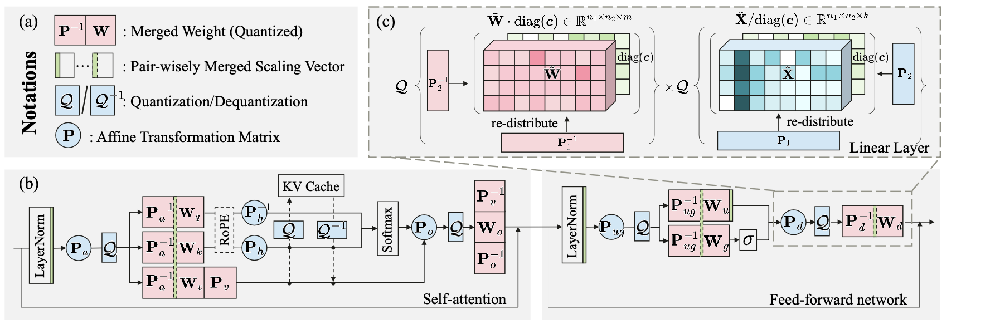
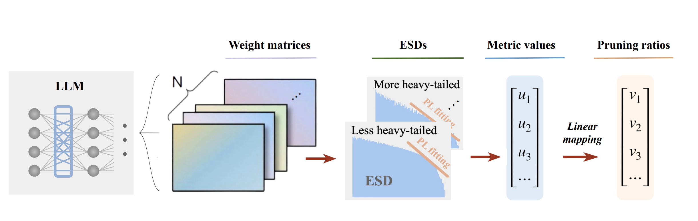
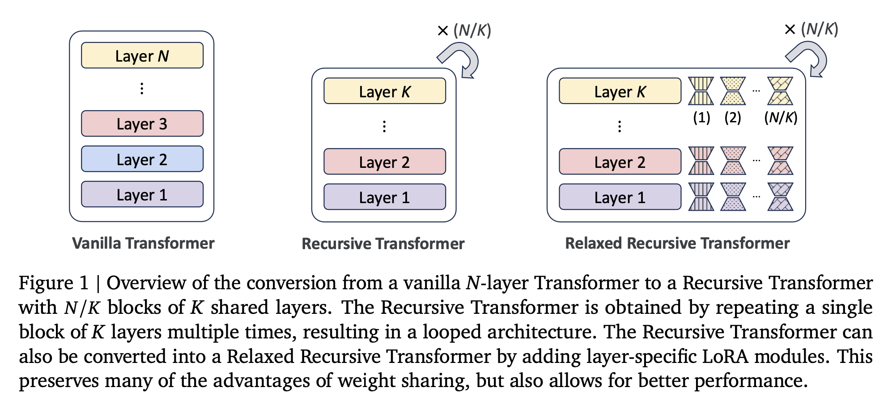

# Efficient-ML

### Papers on Efficient Training and Inference of LLMs and Other Deep Neural Networks

| **Title** | **Summary** |
|:--|:----:|
|  [FLATQUANT: Flatness Matters for LLM Quantization](https://huggingface.co/papers/2410.09426) Published: 12/10/24 Accessed: 22/10/24 Conference: NA Group: NA| 
1. Flattens weight and activation distributions for better quantization. 2. Optimizes affine transformations per linear layer. 3. Uses
|  [AlphaPruning](https://arxiv.org/pdf/2410.10912) Published: 02/10/24 Accessed: 24/10/24 Conference: Neurips Group: NA|   
 1. Suggests a layerwise purning of LLMs for faster infernence   2. Uses HT-SR(Heavytailed Self-regularization) theory and ESDs(Empirical Spectral Density) of matrices to decide layerwise pruning ratios  .  3. Shape metrics outperform scale metrics for computing importance of each layer for pruning. 

| [Relaxed Recursive Transformers](https://arxiv.org/abs/2410.20672) Published: 28/10/24 Accessed: 12/11/24 Conference:ICLR(under reivew) Group: Kaist AI/Deepmind  |   
 1. Introduces LoRA adapters for each layer in the Recursive Transformer, relaxing strict parameter sharing. 2. Finds that averaging the weight matrices of tied layers yields the best results. 3. Proposes continuous depth-wise batching, leveraging the recursive nature of the architecture to achieve 2-3 times faster inference. 4. Outperforms similarly sized pretrained LLMs by using a single block of unique layers and minimal fine-tuning on 15B tokens.
