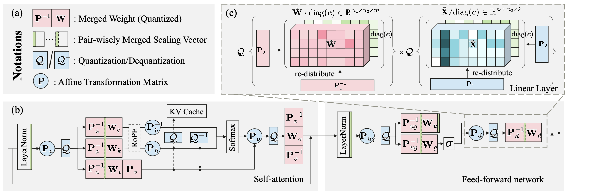

# Efficient-ML

### Papers on Efficient Training and Inference of LLMs and Other Deep Neural Networks

| **Title** | **Main Figure** | **Summary** |
|:--|:----:|:---:|
| [FLATQUANT: Flatness Matters for LLM Quantization](https://huggingface.co/papers/2410.09426) |  | 
 <ul> <li>Flattens weight and activation distributions for better quantization.</li> <li>Optimizes affine transformations per linear layer.</li> <li>Uses lightweight, block-wise training on calibration data.</li> <li>Leverages Kronecker decomposition to reduce memory and computational overhead.</li>

